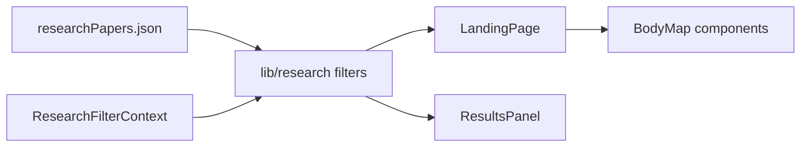

# Repository structure

**Thermal Interaction Web** is a static React SPA for exploring thermal-interaction research papers. Users filter papers by keywords, body region, temperature, duration, and other metadata, then browse results with interactive body-map visualizations. There is no backend; the app loads a bundled JSON dataset and runs entirely in the browser.

---

## Directory tree

Omitted from the tree: `node_modules/`, `dist/`, `.git/`, and OS junk (`.DS_Store`). Large asset folders are summarized with `…` instead of listing every file.

```
thermal-interaction-web/
├── README.md                 # Setup and local dev instructions
├── README.pdf                # PDF copy of the readme
├── .gitignore
│
├── .github/
│   └── workflows/
│       └── main.yml          # GitHub Pages: build frontend, deploy to Pages
│
├── docs/
│   ├── open-in-terminal.png  # Screenshot used in README
│   └── REPO_STRUCTURE.md     # This file
│
├── frontend/                 # Main application (Vite + React + TypeScript)
│   ├── package.json
│   ├── package-lock.json
│   ├── index.html
│   ├── vite.config.ts        # Vite config; `VITE_BASE_PATH` for GitHub Pages
│   ├── tsconfig.json
│   ├── tsconfig.app.json
│   ├── tsconfig.node.json
│   ├── eslint.config.js
│   │
│   ├── public/               # Static assets copied as-is into the build
│   │   ├── favicon.ico
│   │   ├── favicon.svg
│   │   ├── icons.svg
│   │   ├── body-map/         # SVG silhouettes for each body region
│   │   │   ├── full-body.svg
│   │   │   ├── head.svg, neck.svg, torso.svg, leg.svg, foot.svg
│   │   │   ├── arm-left.svg, arm-right.svg
│   │   │   └── hand-inner.svg, hand-outer.svg
│   │   └── paper-thumbnails/ # One image per paper (DOI-based filenames)
│   │       └── … (.jpg, .png, .jpeg, .webp)
│   │
│   └── src/
│       ├── main.tsx            # React entry point
│       ├── App.tsx             # Routes: /, /info, /paper/:paperId
│       ├── index.css           # Global styles
│       │
│       ├── context/
│       │   └── ResearchFilterContext.tsx   # Shared filter state for the app
│       │
│       ├── data/
│       │   └── researchPapers.json         # Curated paper corpus (source of truth)
│       │
│       ├── pages/
│       │   ├── LandingPage.tsx             # Main explorer: filters + results
│       │   ├── LandingPage.css
│       │   ├── PaperDetailPage.tsx         # Single-paper view
│       │   └── InfoPage.tsx                # About / methodology info
│       │
│       ├── components/
│       │   ├── landing/                    # Header, search, filters, result list
│       │   │   ├── Header.tsx
│       │   │   ├── KeywordSearchPanel.tsx
│       │   │   ├── OtherFiltersPanel.tsx
│       │   │   ├── ResultsPanel.tsx
│       │   │   ├── PaperThumbnailPlaceholder.tsx
│       │   │   └── ScrollToTopButton.tsx
│       │   │
│       │   ├── body-map/                   # Interactive SVG body maps + heatmaps
│       │   │   ├── BodyMapPanel.tsx        # Panel wrapper on the landing page
│       │   │   ├── BodyMapSelectionChips.tsx
│       │   │   ├── bodyMapSampleDots.ts    # Dot positions for full-body map
│       │   │   ├── bodyMapVisualization.ts # Shared map rendering helpers
│       │   │   ├── bodyMapSilhouetteAsset.ts
│       │   │   ├── full-body/              # Overview body map
│       │   │   │   ├── BodyMap.tsx
│       │   │   │   └── useBodyMapPartDots.ts
│       │   │   ├── shared/                 # Legend, tooltips, loading, caching
│       │   │   ├── arm/, hand/, foot/, head/, leg/, neck/, torso/
│       │   │   │   ├── *BodyMapDetail.tsx  # Region-specific detail views
│       │   │   │   └── *DetailSampleDots.ts
│       │   │   └── …
│       │   │
│       │   ├── temperature-panel/          # Temperature range filter UI
│       │   ├── duration-panel/             # Stimulus duration filter UI
│       │   ├── distribution-violin/        # KDE / violin plots for distributions
│       │   └── range-slider/               # Reusable dual-thumb range slider
│       │
│       └── lib/
│           ├── publicAssetUrl.ts           # Correct URLs under Vite `base`
│           ├── navigation/
│           │   └── landingScrollRestore.ts
│           └── research/                   # Filtering, labels, body-map logic
│               ├── researchPapers.ts       # Types + accessors for JSON data
│               ├── filterResearchPapers.ts
│               ├── paperKeywordSearch.ts
│               ├── formatPaperDisplay.ts
│               ├── bodyMapRegions.ts
│               ├── bodyMapRegionUtils.ts   # Region geometry / hit testing
│               ├── bodyMapChipSelection.ts
│               ├── bodyMapSiteSide.ts      # Left/right bilateral handling
│               └── …
│
└── scripts/                  # Offline data prep (not part of the runtime app)
    ├── papers_csv_schema.py       # CSV columns = JSON keys; slug validation
    ├── sync_research_papers_from_csv.py   # CSV full replace → JSON
    ├── add_research_papers_with_csv.py    # Append new DOIs only
    ├── export_research_papers_to_import_csv.py
    ├── README.md
    └── papers.csv (optional local export)
```

---

## Brief guide by area

### `frontend/` — the product

Everything users run in the browser lives here. **Vite** bundles the app; **React 19** and **react-router-dom** handle UI and routing. **D3** powers distribution visualizations.

| Layer                      | Role                                                             |
| -------------------------- | ---------------------------------------------------------------- |
| `data/researchPapers.json` | Static dataset of papers and study metadata                      |
| `context/`                 | Global filter state shared across landing and detail views       |
| `pages/`                   | Top-level routes: explorer home, paper detail, info              |
| `components/landing/`      | Search, facet filters, paginated results, thumbnails             |
| `components/body-map/`     | Clickable body maps from SVG assets; drill-down per region       |
| `components/*-panel/`      | Sliders and charts tied to temperature / duration filters        |
| `lib/research/`            | Pure logic: filter papers, map body sites, chip labels, tooltips |
| `public/`                  | SVG body maps and thumbnail images served without import         |

Local dev: `cd frontend && npm install && npm run dev`. Production builds set `VITE_BASE_PATH` (e.g. `/thermal-interaction-web/`) for GitHub Pages project URLs.

### `scripts/` — maintain the dataset

CSV tools sync or append `researchPapers.json` (see `scripts/README.md`). The **thumbnail-collector** is a small Node utility that downloads preview images into `output/`; those files are committed under `frontend/public/paper-thumbnails/`. None of this runs when someone opens the website.

### `.github/workflows/`

CI builds `frontend/` on pushes to `main` and deploys the `dist/` folder to **GitHub Pages** (`setup-node` uses `frontend/package-lock.json` for npm cache). The build copies `index.html` to `404.html` so direct URLs like `/paper/2` work (GitHub Pages SPA fallback).

### `docs/`

Supplementary documentation and assets for the README (this structure doc, terminal screenshot).

---

## Data and request flow (high level)



1. App loads `researchPapers.json` at build time.
2. User adjusts filters (body map, temperature, duration, keywords, etc.).
3. `filterResearchPapers` narrows the list; body maps show density / selection for the active filters.
4. User opens `/paper/:paperId` for metadata and links for one paper.

---

## Related reading

- [README.md](../README.md) — install Node, run dev server, troubleshooting
- [scripts/thumbnail-collector/README.md](../scripts/thumbnail-collector/README.md) — thumbnail download workflow
